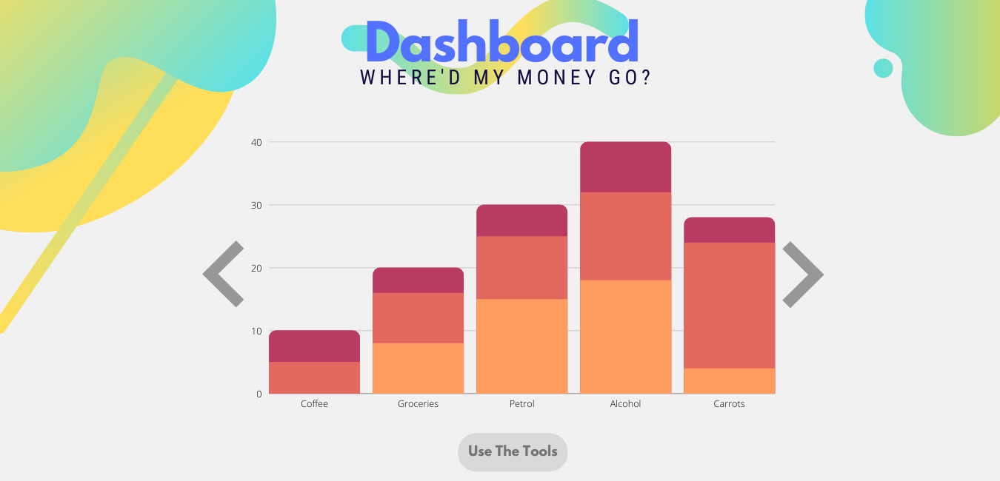
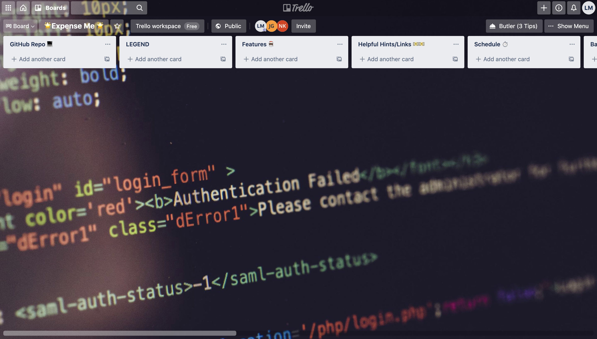

# ExpenseMe App

---

## Purpose (R1)

ExpenseMe is a fullstack web application that aims to assist people with managing their money and analyse their spending habits by allowing users to track their income and spending via an easy-to-use and intuitive user interface. Users are able to log into their accounts and see visually represented graphs of where their money is going.

The application also aims to help users enter a holiday or goal they want to save towards, and then track their progress in reaching that goal.

 

---

## Target Audience (R1)

**_Client requirements_**
The client that requested this application is a young family member of our development team that has asked for an easy-to-use tool to help them track their income and expenditure. The client has recently finished high school and started full-time employment, and would like to track their expenditure quickly throughout the day. They have mentioned that several money tracking apps available on the market have too many features which may be confusing to use. The client asked for a simple and clean user interface where they can see where their money is going at a glance. The application must also protect their private data regarding where they choose to spend their money.

**_Broader target audience_**
Apart from the real-world client, this application may also be used by any other users, who want to manage their money, or would like to create projections of future goals, budgets and expenditure. Each user can only see their own account data after user authentication is completed successfully. This

As good money habits start at a young age, the colourful and intuitive user interface makes this application a good tool for parents to teach their children the value of money. This application can also be a tool for teachers who want to visually demonstrate saving strategies to primary school students.

 

---

## Functionality & features (R1)

**_Interactive user interface_**

The application’s interface visually presents data in an interactive and easy to comprehend way, which makes it easy for users to understand figures quickly while they’re on the go.

Interactive parts of the application include visual components that move as the user scrolls through the page, as well as custom-built animations that initiate when a particular event is triggered by the user.

**_Income and expense tracker_**

Users are able to enter data into the application about:

- their income and the frequency of the income (weekly, fortnightly, monthly, annually)

- expenses the user makes

- select an existing category for the expense

- create a new category for the expense

The application outputs:

- the amount of money left over after the expenses have been deducted from the income

- graphs showing how the user spends their money, including colour representations of expense categories in comparison to each other, and graphs showing the total expenditure of each month of the year

**_Goals progress tracker_**

The application has a feature that allows users to set a goal or holiday, the target amount, when the goal or holiday needs to be reached by, and record amounts that they have deposited towards that goal. There is a graphical visualisation graph that shows how close the user is in reaching their target goal. This feature is designed to encourage users to save money towards a purpose. If the user has not yet entered a goal, the application uses stateful components to render a different page that asks them to set a new goal.

**_Money saving tips_**

Users can choose to view a stack of cards each containing a money-saving tip, in the presentation format of a stack of cards. The user is able to swipe a money tip away to view the next money tip beneath it.

**_Authentication and user profiles_**

Users must create an account to use the application (for privacy reasons as the application handles personal information regarding their income and spending). User authentication is required before each user can access their dashboard in order to protect private information.

**_Database queries of user data_**

Users are able to search the database to see any entries they have previously made, such as what date they made an expense, how much the expense was for, and what category it was for.

 

---

## Tech Stack (R1)

**_Front-end_**

- React: a JavaScript framework for building user interfaces and UI components, used to create front-end components of the application.

- Bulma: a CSS framework used to build the responsive user interface of the application.

**_Back-end_**

- Node.js: a back-end JavaScript runtime environment used to execute JavaScript outside of the browser, such as requesting and opening a file on a server and sending the content to the client.

- Express: a back-end framework for Node.js which allows the application to handle different http requests at a particular route.

- Mongoose: an Object Data Modelling framework which helps Node.js interact with MongoDB by mapping objects.

- Nodemon: a package that monitors the application for changes and restarts the server whenever there is a change in the application, which is useful for the development stage of the application.

**_Database_**

- MongoDB: a NoSQL document database used to store user data.

**_Source version control_**

- Git: Version control software used to track changes the team has made to project files. It allows team members to use separate branches for each feature and merging it to the main branch if the feature is acceptable.

- Github: a cloud-based repository hosting service for git which allows the team to keep track of the Git version control project outside of local computers and servers.

**_Deployment_**

- Netlify: a free hosting platform for deploying web applications.

**_Project Management_**

- Trello board: project management tool that allows team members to create boards, lists and cards to keep track of tasks, features and bugs in the project. It also allows team members to allocate work between each other and see the status of the project as tasks are moved to the “done”

- Discord: communication tool that allows team members to send messages and attend video calls to discuss project progression, work allocation and any bugs/issues.

 

---

## Dataflow Diagram (R2)

 

---

## Application Architecture Diagram (R3)

 

---

## User Stories (R4)

- As a user, I want my personal information about my income and spending to be protected by a password.

- As a user, I want to have an account that I can create, edit or delete.

- As a user, I want to log in and log out of my account at any time.

- As a user, I want to be able to record and save my income amount and how often my income is.

- As a user, I want to access any previously saved information I have entered into the application once I have logged into my account.

- As a user, I want to be able to edit the record of my income if it changes.

- As a user, I want to be able to set the date range or time period that relates to my income.

- As a user, I want to access and view previous income and expenditure information that I have entered into the application.

- As a user, I want to see a visual representation of where my money goes in terms of the category of spending.

- As a user, I want to be able to record my upcoming holidays and goals and upload a picture of that holiday/goal.

- As a user, I want to know how long it will take me to save up for a holiday or goal.

- As a user, I want to record how much money I’ve saved towards a holiday or goal and how much left I have to go to reach that goal.

- As a user, I want the option see money saving tips, but only if I choose to.

 

---

## Wireframes (R5)

### Home Page

### Log In

### Sign Up

### Dashboard

### Tools

### Make An Entry

### Money Saving Tips

### Goal Creation

### Goal Tracking

## Mockups

### Home Page

### Log In/Sign Up

### Dashboard

### Tools

## Trello board screenshots (R6)

For the duration of the project Nate, Julie and Luke have adapted an Agile project management methodology as an iterative approach to the software development cycle.
Our DevOps Process will take aim to deliver the product in a structured and organised fashion. Ensuring efficiency and quality throughout production.

### First phase progression can be found here: [https://trello.com/b/j4C1WFzE/t1a3-terminal-application](https://trello.com/b/j4C1WFzE/t1a3-terminal-application)

 

---
